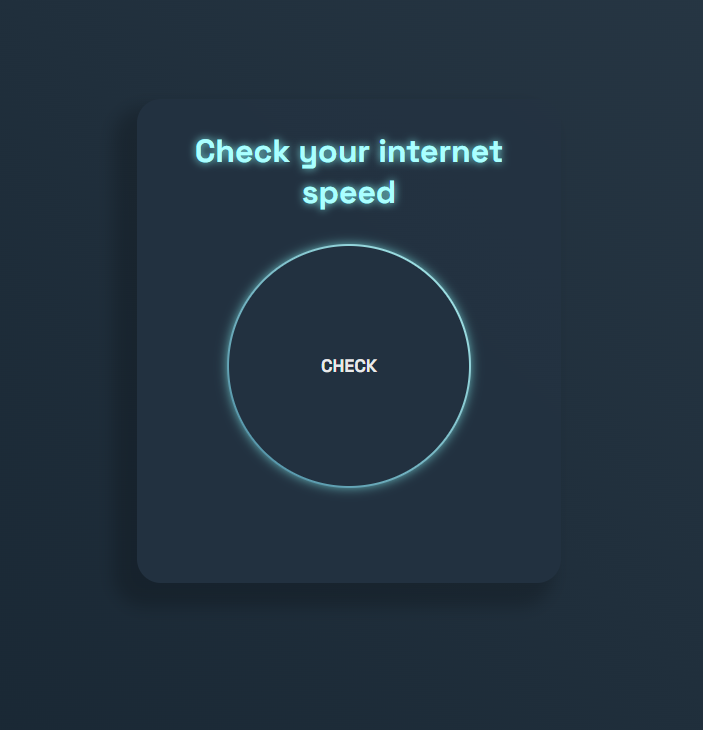

# internet_speed_test

# Description
This is a simple Internet speed tester built with JavaScript. It allows users to check their internet connection speed by measuring the download and upload speeds.

# Demo
Click for Demo <a href='https://ziauddin128.github.io/internet_speed_test/' target = "_blank">Click</a>

# Features

<b>Download Speed Test:</b> Measure the speed of downloading data from the internet. 

<b>Upload Speed Test:</b> Measure the speed of uploading data to the internet.

<b>User-Friendly Interface:</b> The interface is designed to be simple and intuitive.

# How to Use 
1) Clone the repository to your local machine.
    - git clone https://github.com/ziauddin128/internet_speed_test.git
    - Or Download the zip file
2) Open the index.html file in a web browser.
3) Click the "Check" button to initiate the speed test.
4) Wait for the test to complete, and the results will be displayed on the screen.

